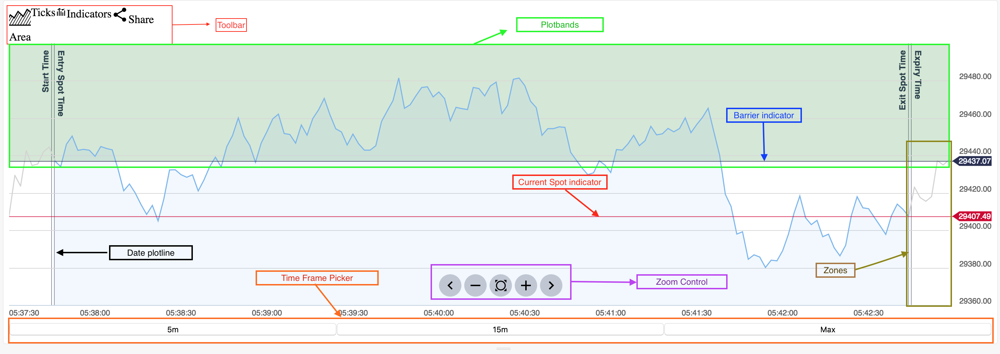

## Binary charts anatomy

### Toolbar
This should be styled by library user, it provides control for changing ChartType, Interval of data, Indicators and export chart as images.

-------

### Plotbands
The green area on the chart is achieved using [Axis.addPlotband](http://api.highcharts.com/highstock/Axis.addPlotBand) feature from highcharts,
it indicates region that client would win if his contract ends or reach the region.
Plotbands is different depending on contract type
Code is in [plot-bands](../src/plot-bands)

-------

### Barrier indicator
The tiny dark blue line, refer to the barrier, serve as a splitting line between winning region (green color) and losing region (non-colored).
It is rendered using custom [plugin](../src/plugins/axisIndicators.js), barrier value is extracted from either `trade` or `contract` object
passed from component parent.

__Important note:__
Highcharts will automatically adjust yAxis based on series data (real data), so if barrier value is too far away from series data,
the line will not be visible. To overcome this problem, we use [hiddenSeries](../src/config/createHiddenSeries.js)

The basic concept is that, highchart by default adjust it's yAxis to ensure all series data is visible on the chart, to leverage this property,
we create invisible series (by setting lineWidth = 0) for each barrier we want to render, so that it takes up space,
but does not actually render line, then our axisIndicator plugin will render the line for us.

An important point on this, is that we never remove and add back series, when number of barriers changed, because adding and removing series is
roughly 50 times slower than reusing existing series by setData.

**To dev: There's no strong evidence that using visible series directly is slower, we should consider render using series instead of the plugin
we have been using**

### Current spot indicator
The red line, it's value have different meaning depends on scenario

 1. If there's a completed contract in chart, ie. contract with `exit_spot_time`, the red line will take the `exit_spot` value
 , to indicate where does the contract ends.
 2. In other cases, it will take the latest data value, to indicate current point

It is rendered using the same [plugin](../src/plugins/axisIndicators.js) as Barrier indicator.

-------

### Date plotline
This is used to visualize some date related information of contract, achieved using [Axis.addPlotLine](http://api.highcharts.com/highstock/Axis.addPlotLine)
Source code in [plot-lines](../src/plot-lines)

-----

### Zones
Zones refer to vertically separated part of chart, that only appears when there's a `contract` being passed to chart. It is used to differentiate
the data within contract and out of contract

-----

### Zoom Control
A panel containing buttons for user to move along x-axis of chart

-----

### Time frame picker
Buttons at the bottom of chart, allow user to choose specific time frame to view on charts.